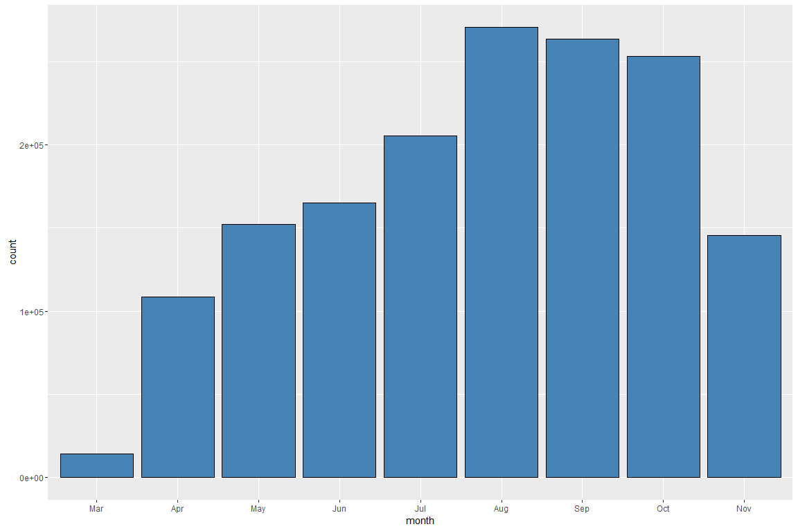
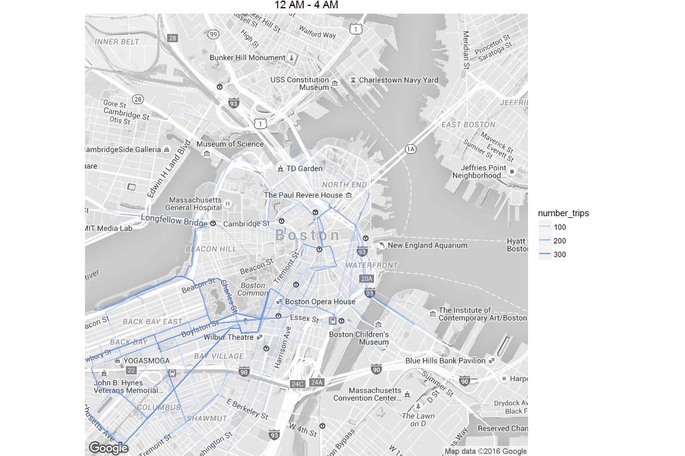

# Hubway Trip Data
Prasun Srivastava  
27 March 2016  

The dataset for this analysis has been obtained from the [Hubway data Challenge.](http://hubwaydatachallenge.org/) The dataset contains the trip data for each bike ride from July 2011 to end of 2013. I will start with a few leading questions to guide my exploration:

* What is the distribution of the trip time? What is the average trip time?
* Do people use the bikes for shorter trip times or longer ones?
* When are most of the trips initiated? During what time of day, there are more commuters?
* Are there more male users or female ones? 
* What is the average age of the bike users? Does it differ among males and females?
* Which is the most popular station for source? Which station is most popular as destination? Which is the most popular source-destination pair?


Let us start by importing the dataset which is a csv file and viewing the structure of the data.


```
## 'data.frame':	1579025 obs. of  13 variables:
##  $ seq_id    : int  1 2 3 4 5 6 7 8 9 10 ...
##  $ hubway_id : int  8 9 10 11 12 13 14 15 16 17 ...
##  $ status    : chr  "Closed" "Closed" "Closed" "Closed" ...
##  $ duration  : int  9 220 56 64 12 19 24 7 8 1108 ...
##  $ start_date: chr  "7/28/2011 10:12:00" "7/28/2011 10:21:00" "7/28/2011 10:33:00" "7/28/2011 10:35:00" ...
##  $ strt_statn: int  23 23 23 23 23 23 23 23 23 47 ...
##  $ end_date  : chr  "7/28/2011 10:12:00" "7/28/2011 10:25:00" "7/28/2011 10:34:00" "7/28/2011 10:36:00" ...
##  $ end_statn : int  23 23 23 23 23 23 23 23 23 40 ...
##  $ bike_nr   : chr  "B00468" "B00554" "B00456" "B00554" ...
##  $ subsc_type: chr  "Registered" "Registered" "Registered" "Registered" ...
##  $ zip_code  : chr  "'97217" "'02215" "'02108" "'02116" ...
##  $ birth_date: int  1976 1966 1943 1981 1983 1951 1971 1971 1983 1994 ...
##  $ gender    : chr  "Male" "Male" "Male" "Female" ...
```
As can be seen from the structure of the dataframe, start and end stations are numeric values, start and end dates of the trips are strings which should be ideally date time variables. Next, we clean the data as per our requirement.


Now, let us start by summarising the data for each column.


```
##      seq_id          hubway_id          status           duration       
##  Min.   :      1   Min.   :      8   Closed:1579025   Min.   :   -6900  
##  1st Qu.: 394757   1st Qu.: 446525                    1st Qu.:     412  
##  Median : 789513   Median : 895044                    Median :     660  
##  Mean   : 789513   Mean   : 886532                    Mean   :    1200  
##  3rd Qu.:1184269   3rd Qu.:1328083                    3rd Qu.:    1082  
##  Max.   :1579025   Max.   :1748022                    Max.   :11994458  
##                                                                         
##    start_date                    strt_statn    
##  Min.   :2011-07-28 10:12:00   Min.   :  3.00  
##  1st Qu.:2012-08-07 09:27:00   1st Qu.: 27.00  
##  Median :2013-05-16 22:46:00   Median : 48.00  
##  Mean   :2013-02-03 07:58:39   Mean   : 54.38  
##  3rd Qu.:2013-08-22 20:39:00   3rd Qu.: 74.00  
##  Max.   :2013-11-30 23:39:00   Max.   :145.00  
##                                NA's   :14      
##     end_date                     end_statn         bike_nr       
##  Min.   :2011-07-28 10:12:00   Min.   :  3.00   B00490 :   2138  
##  1st Qu.:2012-08-07 09:37:00   1st Qu.: 29.00   B00268 :   2124  
##  Median :2013-05-16 23:01:00   Median : 48.00   B00548 :   2112  
##  Mean   :2013-02-03 08:18:39   Mean   : 54.26   B00559 :   2091  
##  3rd Qu.:2013-08-22 20:57:00   3rd Qu.: 74.00   B00563 :   2080  
##  Max.   :2013-12-01 00:16:00   Max.   :145.00   B00391 :   2072  
##                                NA's   :45       (Other):1566408  
##       subsc_type         zip_code        birth_date         gender      
##  Casual    : 472611          :472766   Min.   :1932            :472611  
##  Registered:1106414   02118  :121749   1st Qu.:1969      Female:271700  
##                       02139  : 89437   Median :1979      Male  :834714  
##                       02215  : 86758   Mean   :1976                     
##                       02116  : 77279   3rd Qu.:1985                     
##                       02115  : 57522   Max.   :1995                     
##                       (Other):673514   NA's   :1228381                  
##  strt_statn_name    end_statn_name    
##  Length:1579025     Length:1579025    
##  Class :character   Class :character  
##  Mode  :character   Mode  :character  
##                                       
##                                       
##                                       
## 
```

The minimum trip duration is negative as seen above in the summary output! This is highly unlikely. This must be an error. Let us examine this record.


```
##          seq_id hubway_id status duration          start_date strt_statn
## 1515192 1515192   1680971 Closed    -6900 2013-11-03 01:58:00         75
##                    end_date end_statn bike_nr subsc_type zip_code
## 1515192 2013-11-03 01:03:00       136  B00205 Registered    02141
##         birth_date gender
## 1515192         NA   Male
##                                              strt_statn_name
## 1515192 Lafayette Square at Mass Ave / Main St / Columbia St
##                             end_statn_name
## 1515192 Biogen Idec - Binney St / Sixth St
```

The start date of the trip is greater than the end date of the trip which is not possible unless the person was driving a time machine!!! Let us remove all record from the trips data where the duration is negative.


```
##      seq_id          hubway_id          status           duration       
##  Min.   :      1   Min.   :      8   Closed:1578976   Min.   :       0  
##  1st Qu.: 394745   1st Qu.: 446513                    1st Qu.:     412  
##  Median : 789507   Median : 895038                    Median :     660  
##  Mean   : 789501   Mean   : 886518                    Mean   :    1201  
##  3rd Qu.:1184250   3rd Qu.:1328063                    3rd Qu.:    1082  
##  Max.   :1579025   Max.   :1748022                    Max.   :11994458  
##                                                                         
##    start_date                    strt_statn    
##  Min.   :2011-07-28 10:12:00   Min.   :  3.00  
##  1st Qu.:2012-08-07 09:20:00   1st Qu.: 27.00  
##  Median :2013-05-16 22:45:00   Median : 48.00  
##  Mean   :2013-02-03 07:52:26   Mean   : 54.38  
##  3rd Qu.:2013-08-22 20:36:00   3rd Qu.: 74.00  
##  Max.   :2013-11-30 23:39:00   Max.   :145.00  
##                                NA's   :14      
##     end_date                     end_statn         bike_nr       
##  Min.   :2011-07-28 10:12:00   Min.   :  3.00   B00490 :   2138  
##  1st Qu.:2012-08-07 09:31:00   1st Qu.: 29.00   B00268 :   2124  
##  Median :2013-05-16 22:59:00   Median : 48.00   B00548 :   2112  
##  Mean   :2013-02-03 08:12:26   Mean   : 54.26   B00559 :   2091  
##  3rd Qu.:2013-08-22 20:51:15   3rd Qu.: 74.00   B00563 :   2080  
##  Max.   :2013-12-01 00:16:00   Max.   :145.00   B00391 :   2072  
##                                NA's   :45       (Other):1566359  
##       subsc_type         zip_code        birth_date         gender      
##  Casual    : 472577          :472732   Min.   :1932            :472577  
##  Registered:1106399   02118  :121749   1st Qu.:1969      Female:271697  
##                       02139  : 89436   Median :1979      Male  :834702  
##                       02215  : 86757   Mean   :1976                     
##                       02116  : 77277   3rd Qu.:1985                     
##                       02115  : 57521   Max.   :1995                     
##                       (Other):673504   NA's   :1228332                  
##  strt_statn_name    end_statn_name    
##  Length:1578976     Length:1578976    
##  Class :character   Class :character  
##  Mode  :character   Mode  :character  
##                                       
##                                       
##                                       
## 
```

Let us plot the distribution of trip duration.

 

The trip duration is right skewed with most of the trips concentrated around the lower values. The median trip time (shown as orange vertical line)is 660s (11 minutes). 

Next, let us take a look at the trip times for registered users and casual users.

 

In the above plot, the vertical line depicts the free trip time of 30 minutes (1800s). Trips above 30 minutes incur overtime fees. More casual users tend to use the bike for more than 30 minutes than the registered users. Hence, the casual users must be incurring more overtime fees than the registered users. This might be due to the unawareness among casual users about the pricing scheme.

Next, let us take a look at the trip times for males and females. Since, we know that the gender information is captured only for the registered members, let us split our trips data based on membership.

 

```
## subset(trips, subsc_type == "Registered")$gender: 
## [1] NA
## -------------------------------------------------------- 
## subset(trips, subsc_type == "Registered")$gender: Female
## [1] 600
## -------------------------------------------------------- 
## subset(trips, subsc_type == "Registered")$gender: Male
## [1] 524
```

The distribution of trip times for both males and females is similar except the median trip time for females is slightly higher than the males. This might be due to the variation in speed of riding bikes among males and females. We will try to explore this later on. Also, from the count of the trips, it seems that there are more males using the bike service than the females.

Next, let us look at the distribution of trips over different days of week.

 

From the above plot, we can see that the number of trips are similar for weekdays and low on weekends. This might be due to the fact that the people use bikes for commute to offices and there is no commute to work on weekends. However, if that were the case, the number of trips on weekends should have been far lower than the weekdays; which is not the case. 

The above plot has got me interested. People who are registered users might be the ones who use the bike service to commute on a daily basis. Does the subscription type affect the trips distribution by day?

 

The registered users use the bike service more on weekdays and the casual users more on weekends. One possible explanation to this might be that the registered users use the bike service to commute to work on a daily basis whereas the casual users are the ones who roam the city for fun or maybe they are tourists.

Next, I want to look if male and females have different patterns for bike use on different days of week.

 

There is no apparent pattern. Both males and females have similar bike use pattern on all days of the week. Next, let us explore the trips by time of day.

 

The bike usage peaks two times during the day; once between 8 and 9 AM in the morning and again between 5 and 6 PM in the evening. This again suggests that the bike users might be commuting to and from office. Next, let us look at the distribution by hour for each day of the week.

 

Our assumption about bike ride to and from office might be correct as the same pattern holds for weekdays but not on weekends. On weekends, the data is mostly normally distributed peaking around 3 PM in the afternoon. Moreover, the number of trips taken on Saturday is more than on Sunday. It seems people want to spend time at home on Sundays. Also, if we look closely, we find that the bike trips rise on Saturday and Sunday between 12 AM and 3 AM as compared to other days. This might be due to people going out on Fridays and Saturdays at night. 

Next, let us look at the same distribution for casual and registered users.

 

Again, it is evident that the casual users utilize bike services more during the weekends than weekdays. However, I want to summarize all the findings in a single chart. As weekdays have overall similar pattern, I will split the data as per weekday and weekend.

 

How does the bike usage differ by month?

 

The bike usage peaks in August and September and there is no usage during the months of December, January and February. This makes sense as December, January and February are the coldest months of the year.

Next, I want to understand the age distribution of the people riding the bikes. Since, we have birth date information only for the registered users, we will plot the data for them only.

 

The age distribution is also right skewed with most people under the ages of 35. Let us take a look at the distribution of the ages by gender.

 

```
## trips$gender: 
##    Min. 1st Qu.  Median    Mean 3rd Qu.    Max.    NA's 
##      NA      NA      NA     NaN      NA      NA  472577 
## -------------------------------------------------------- 
## trips$gender: Female
##    Min. 1st Qu.  Median    Mean 3rd Qu.    Max.    NA's 
##    17.0    26.0    31.0    34.1    40.0    79.0  184679 
## -------------------------------------------------------- 
## trips$gender: Male
##    Min. 1st Qu.  Median    Mean 3rd Qu.    Max.    NA's 
##    17.0    27.0    33.0    35.9    44.0    78.0  571076
```

The age distribution for both males and females is right skewed with median ages being 31 and 33 year for females and males respectively.

Let us try to estimate the speed of the bike. We have duration of the trip and if we are able to calculate the distance between the two stations, we will be able to estimate the speed. In order to do this, I compiled the distance between two stations using the Google maps distance API in a csv file (`origin_destination.csv`). Since, there is an upper limit on 2500 queries per day for the API, the data was compiled over a period of time for around 14000 unique trips. A sample script used to compile the distances is in the project folder (`get_distance.R`). Also, for this analysis, only those trips will be considered where source and destination were different and at least one of the station info is present.

 

Most of the trips are estimated to be between speeds of 10 - 15 Km/hr. Although, there are many trips that have an estimated speed grater than 60 Km/hr which seems very unlikely to me. Let us take a look at the speed distribution for males and females by age.

 

Older people tend to cycle slower than the younger people and males tend to cycle faster on average than females. Let us check if the subscription type affects the speed.

 

The registered users tend to have higher speeds than the casual bikers. This might be because casual bikers might be using to roam around leisurely. Next, let us check the distribution of the distance.

 

Next, let us look at the distribution of distance by gender and examine the distance summary by gender.

 

```
## subset(trips_distance, subsc_type == "Registered")$gender: 
## NULL
## -------------------------------------------------------- 
## subset(trips_distance, subsc_type == "Registered")$gender: Female
##    Min. 1st Qu.  Median    Mean 3rd Qu.    Max. 
##   0.137   1.385   2.104   2.474   3.203  12.590 
## -------------------------------------------------------- 
## subset(trips_distance, subsc_type == "Registered")$gender: Male
##    Min. 1st Qu.  Median    Mean 3rd Qu.    Max. 
##   0.137   1.305   1.957   2.360   3.059  13.000
```

Earlier, we had seen that the trip duration for females is slightly higher than the males. However, this is due to the reason that the females have a higher median distance traveled.

Let us move forward to answer the question about most popular source station.

 

In the above plot, we have plotted the top 5 source stations. The Seaport Boulevard is the top source station. However, now I have a question; does the top source stations change during different times of day? In order to answer this question, we would divide whole day in 4-hour buckets. Let us define these buckets as follows:

* 12 AM - 4 AM: Night
* 4 AM - 8 AM: Early morning
* 8 AM - 12 PM: Morning
* 12 PM - 4 PM: Afternoon
* 4 PM - 8 PM: Evening
* 8 PM - 12 AM: Late Evening

  

As can be seen from the above plot, the most popular source stations change between morning and evening except for the first most popular station (South Station 700 Atlantic Avenue). 

This has got me thinking what are the most popular source-destination pairs by different times of day.


```
##                                  start_station
## 1                         Beacon St / Mass Ave
## 2                 MIT at Mass Ave / Amherst St
## 3  The Esplanade - Beacon St. at Arlington St.
## 4     Boston Public Library - 700 Boylston St.
## 5                 MIT at Mass Ave / Amherst St
## 6                  Lewis Wharf - Atlantic Ave.
## 7       TD Garden - Causeway at Portal Park #1
## 8            South Station - 700 Atlantic Ave.
## 9            South Station - 700 Atlantic Ave.
## 10           South Station - 700 Atlantic Ave.
## 11                MIT at Mass Ave / Amherst St
## 12           South Station - 700 Atlantic Ave.
## 13           South Station - 700 Atlantic Ave.
## 14               Boylston St. at Arlington St.
## 15                   Boylston St / Berkeley St
## 16                MIT at Mass Ave / Amherst St
## 17                        Beacon St / Mass Ave
## 18                MIT at Mass Ave / Amherst St
## 19               Agganis Arena - 925 Comm Ave.
## 20               B.U. Central - 725 Comm. Ave.
## 21                        Beacon St / Mass Ave
## 22                     TD Garden - Legends Way
## 23                 Lewis Wharf - Atlantic Ave.
## 24           South Station - 700 Atlantic Ave.
## 25                       Kenmore Sq / Comm Ave
## 26                        Beacon St / Mass Ave
## 27                MIT at Mass Ave / Amherst St
## 28                       Kenmore Sq / Comm Ave
## 29                         Boylston / Mass Ave
## 30                       Kenmore Sq / Comm Ave
##                                       end_station    day_period
## 1                    MIT at Mass Ave / Amherst St     Afternoon
## 2                            Beacon St / Mass Ave     Afternoon
## 3     The Esplanade - Beacon St. at Arlington St.     Afternoon
## 4        Boston Public Library - 700 Boylston St.     Afternoon
## 5         MIT Stata Center at Vassar St / Main St     Afternoon
## 6               South Station - 700 Atlantic Ave. Early Morning
## 7                              Congress / Sleeper Early Morning
## 8                      Rowes Wharf - Atlantic Ave Early Morning
## 9                   Boylston St. at Arlington St. Early Morning
## 10                      Boylston St / Berkeley St Early Morning
## 11                           Beacon St / Mass Ave       Evening
## 12                        TD Garden - Legends Way       Evening
## 13                    Lewis Wharf - Atlantic Ave.       Evening
## 14              South Station - 700 Atlantic Ave.       Evening
## 15              South Station - 700 Atlantic Ave.       Evening
## 16                           Beacon St / Mass Ave  Late Evening
## 17                   MIT at Mass Ave / Amherst St  Late Evening
## 18                          Kenmore Sq / Comm Ave  Late Evening
## 19                          Kenmore Sq / Comm Ave  Late Evening
## 20 Packard's Corner - Comm. Ave. at Brighton Ave.  Late Evening
## 21                   MIT at Mass Ave / Amherst St       Morning
## 22              South Station - 700 Atlantic Ave.       Morning
## 23              South Station - 700 Atlantic Ave.       Morning
## 24                    Lewis Wharf - Atlantic Ave.       Morning
## 25                   MIT at Mass Ave / Amherst St       Morning
## 26                   MIT at Mass Ave / Amherst St         Night
## 27                           Beacon St / Mass Ave         Night
## 28                   MIT at Mass Ave / Amherst St         Night
## 29                     Yawkey Way at Boylston St.         Night
## 30 Packard's Corner - Comm. Ave. at Brighton Ave.         Night
##    number_trips
## 1          1279
## 2          1277
## 3          1160
## 4           890
## 5           816
## 6          1018
## 7           986
## 8           756
## 9           701
## 10          613
## 11         2035
## 12         1870
## 13         1715
## 14         1622
## 15         1313
## 16          893
## 17          774
## 18          462
## 19          434
## 20          421
## 21         1367
## 22         1331
## 23         1313
## 24         1222
## 25         1069
## 26          327
## 27          291
## 28          158
## 29          148
## 30          127
```

Although the above table output is okay to understand the top 5 source-destination pairs by time of day, it would be nice if we could plot the above data on top of a map. In order to do this, I compiled the bicycle routes for each source-destination pair from Google maps route API into a single `routes_info.csv` file. The script used to generate the file is included in the project folder. The name of the file is `get_route.R`. Let us plot the route of these source-destination pairs on the map.

      

# Final Plots and Summary

In this section, I will discuss the three main takeaways from this data exploration.

### First Plot

The first plot that I have chosen as the key takeaway is the plot of trip times.

 

The casual users tend to use the bike beyond the free usage limit of 30 minutes. This incurs overtime fee for these users. This might be due to lack of awareness among the casual users about the pricing of bike use. Hubway should raise awareness among the casual users about their pricing scheme.

### Second Plot

The second plot shows the distribution of trips by time of day.

 

The casual users use the bike service mostly on weekend whereas the registered users use the service mostly during weekdays. During the weekdays, the bike use among the registered users shows two clear peaks in usage: one during 8 AM to 9 AM and the other between 5 PM to 6 PM. This is suggestive of bike use for commute to and from office. There is a rise in bike use on Saturday and Sunday by both casual and registered users between 12 AM to 3 AM as compared to other days. This might be due to people going out on Friday and Saturday night. 

### Third Plot

The third plot shows the bike routes by number of trips 

      

The area around Boylston Street, Arlington Street and Back Bay is active during all times. People tend to visit the harborwalk area around the New England Aquarium during early morning and morning hours. There are a lot of trips between South Station and Atlantic Avenue during all times except during night. Also, in the evening, there is activity between South Station and TD Garden. 

# Reflection

I started off with a set of questions to guide my exploration and was able to dive into those questions during the analysis. As a person who has never been to Boston, the bike use data has provided with great insights into the culture of the city. There are patterns which suggest the use of bike for commute during weekdays. People seem to spend time during early hours of the day around the waterfront areas. Although these conclusions are not certain and might not be representative of the culture of the city as a whole but it still has provided me with some insights to the city.

Most of the analysis was done pretty quickly. However, the compilation of distances and routes from the Google maps API took a lot of time. In order to plot the routes on the map, I first started off with plotting greater circle arcs on a blank outline of Boston. However, it was soon clear that it was not a viable solution and did not provide any insights into the bike use pattern. Then, I started by plotting a few routes on the map of Boston and it was clear that it was the  way to go about finding patterns in bike routes during different times of day. Having no experience in plotting maps, it took me a lot of time to understand the basics of spatial visualization and then move towards the end goal that I had in vision.
